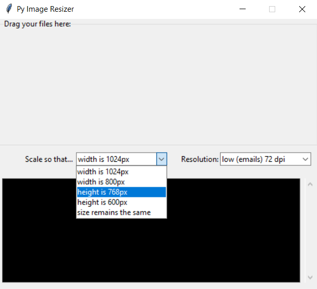

# PYImageResizer

A simple no-frills GUI utility to help novice users with resizing camera images.

The app presents a GUI with simple presets and a drop zone into which images (or folders) can be dragged for processing. In the case of folders, only the 1st level of files are processed.

## Usage (Development)

You will need to specify the path to the folder containing the tkdnd binaries:
~~~
pip install -r requirements.txt

@set PYTHONPATH=%PYTHONPATH%;%~dp0;%~dp0\src;
@set TKDND_PATH=%~dp0Lib\site-packages\tkdnd\tkdnd\win64
python -m pyimageresizer
~~~

## Building (Windows)

If you have pyinstaller, there is a .spec file included.
This was built using python 3.7. You may need to adjust the path to your python installation accordingly.
